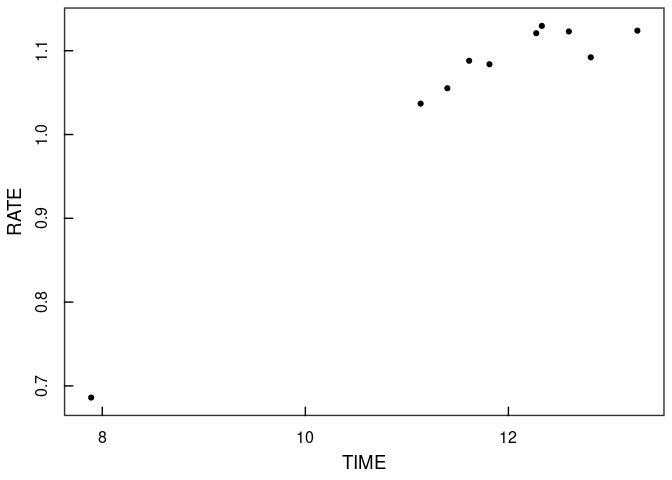

Swift UVOT Workbook
================
Adam Gonzalez

``` r
source("functions.R")
library(ggplot2)
paper.theme <- theme_bw() +
  theme(panel.border = element_rect(fill = NA, linewidth = 1),
        panel.grid.major = element_blank(), panel.grid.minor = element_blank(),
        axis.ticks = element_line(colour = "black", linewidth = 0.5),
        axis.ticks.length = unit(-0.25, "cm"),
        axis.text.x = element_text(colour = "black", size = 12, margin = (unit(c(t = 0.4, r = 0, b = 0.1, l = 0), "cm"))),
        axis.text.y = element_text(colour = "black", size = 12, margin = (unit(c(t = 0, r = 0.4, b = 0, l = 0.1), "cm")), angle = 90, hjust = 0.5),
        text = element_text(colour = "black", size = 14),
        plot.title = element_text(hjust = 0.5, size = 14, face = "bold"))
theme_set(paper.theme)
```

``` r
uvot.lc <- lc.uvot("uvotsource_outputfiles", "mJy")
```

    ## Working on observation:   1  /  458 Working on observation:   2  /  458 Working on observation:   3  /  458 Working on observation:   4  /  458 Working on observation:   5  /  458 Working on observation:   6  /  458 Working on observation:   7  /  458 Working on observation:   8  /  458 Working on observation:   9  /  458 Working on observation:   10  /  458 

With all of the Swift UVOT files produced by uvotsource read in, we can
now focus on the 2022 epoch. We can use the HEASARC
[xTime](https://heasarc.gsfc.nasa.gov/cgi-bin/Tools/xTime/xTime.pl) tool
to convert the 2022 epoch start date of 28 Aug 2022 into units of Swift
Mission Elapsed Time (MET), which yields MET = 683337629.755 seconds.
Then, we can break the ‘master’ light curve into light curves for each
individual filter and have a look at our light curve data.

``` r
met.aug282022 <- 683337629.755
day.seconds <- 86164.0905
uvot.lc$TIME <- (uvot.lc$TIME - met.aug282022)/day.seconds
uvot.lc$TIME.ERR <- uvot.lc$TIME.ERR/day.seconds
uvot.lc <- uvot.lc[which(uvot.lc$TIME >= 0),]

w2.lc <- uvot.lc[which(uvot.lc$FILTER == "w2"), c("TIME", "TIME.ERR", "RATE", "RATE.ERR")]
m2.lc <- uvot.lc[which(uvot.lc$FILTER == "m2"), c("TIME", "TIME.ERR", "RATE", "RATE.ERR")]
w1.lc <- uvot.lc[which(uvot.lc$FILTER == "w1"), c("TIME", "TIME.ERR", "RATE", "RATE.ERR")]
u.lc <- uvot.lc[which(uvot.lc$FILTER == "uu"), c("TIME", "TIME.ERR", "RATE", "RATE.ERR")]
b.lc <- uvot.lc[which(uvot.lc$FILTER == "bb"), c("TIME", "TIME.ERR", "RATE", "RATE.ERR")]
v.lc <- uvot.lc[which(uvot.lc$FILTER == "vv"), c("TIME", "TIME.ERR", "RATE", "RATE.ERR")]

ggplot() +
  geom_point(data = w2.lc, aes(x = TIME, y = RATE), )
```

<!-- -->
