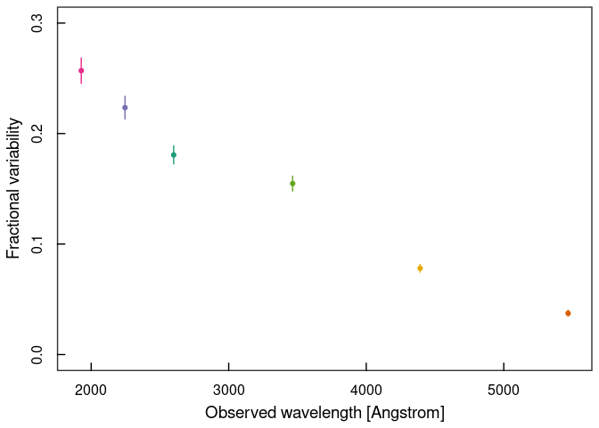
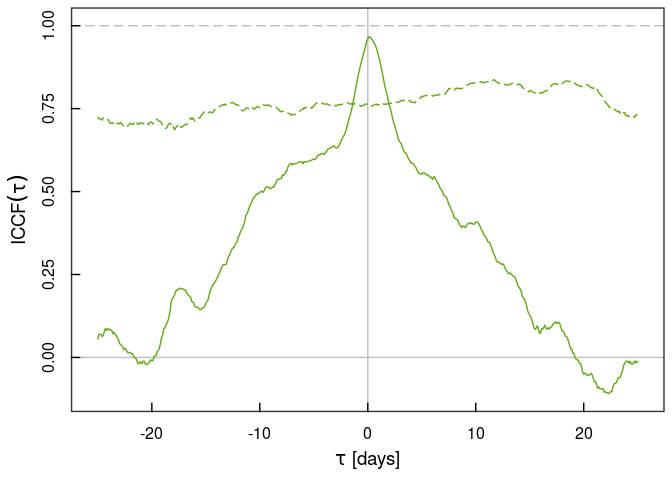
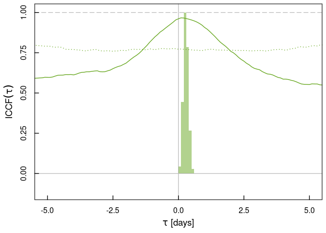
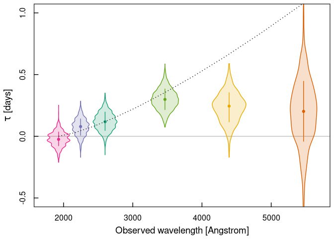

Swift UVOT Workbook
================
Adam Gonzalez

This workbook guides you through my analysis workflow for
multi-wavelength *Swift* UVOT observing campaigns, specifically for the
2022 campaign on NGC 6814 as published in [my
paper](https://academic.oup.com/mnras/article/527/3/5569/7425644),
though the workflow and methods can be applied to any *Swift* campaign.

# Setting up the environment

First, we need to load the method functions as well as the ggplot2
package with my custom theme. The functions.R file contains all of the
code for the methods used throughout this workbook, so you should go
over them to actually understand what is happening at each step.

``` r
source("functions.R")
```

    ## Loading required package: iterators

``` r
library(ggplot2)
paper.theme <- theme_bw() +
  theme(panel.border = element_rect(fill = NA, linewidth = 1),
        panel.grid.major = element_blank(), panel.grid.minor = element_blank(),
        axis.ticks = element_line(colour = "black", linewidth = 0.5),
        axis.ticks.length = unit(-0.25, "cm"),
        axis.text.x = element_text(colour = "black", size = 12, margin = (unit(c(t = 0.4, r = 0, b = 0.1, l = 0), "cm"))),
        axis.text.y = element_text(colour = "black", size = 12, margin = (unit(c(t = 0, r = 0.4, b = 0, l = 0.1), "cm")), angle = 90, hjust = 0.5),
        text = element_text(colour = "black", size = 14),
        plot.title = element_text(hjust = 0.5, size = 14, face = "bold"))
theme_set(paper.theme)
```

# Reading in the light curve data

Our first task is to process the *Swift* UVOT data, which is *not*
performed in this workbook. *Swift* UVOT data can be publicly accessed
via the [HEASARC data
archive](https://heasarc.gsfc.nasa.gov/docs/archive.html). Once you’ve
downloaded the data, you’ll need to process it using the tasks included
in [HEASoft](https://heasarc.gsfc.nasa.gov/docs/software/lheasoft/) with
the latest [calibration
files](https://heasarc.gsfc.nasa.gov/docs/heasarc/caldb/caldb_intro.html).
You’ll need to run `uvotsource` on the UVOT images to get the outputs
expected as inputs for the methods used here. Once you’ve done all of
that, you can begin the analysis process.

I’ve placed my `uvotsource` output FITS files in the
`uvotsource_output/` directory. We’ll start by loading all of the output
files and merging them into a single `R` data frame. The data frame will
contain information on the observation ID number, start time, UVOT
filter, and flux values in units specified by the user, which in this
case will be count rate.

``` r
uvot.lc <- lc.uvot(file.path = "uvotsource_outputfiles", flux.units = "rate")
```

    ## Working on observation:   1  /  458 Working on observation:   2  /  458 Working on observation:   3  /  458 Working on observation:   4  /  458 Working on observation:   5  /  458 Working on observation:   6  /  458 Working on observation:   7  /  458 Working on observation:   8  /  458 Working on observation:   9  /  458 Working on observation:   10  /  458 Working on observation:  11  /  458 Working on observation:  12  /  458 Working on observation:  13  /  458 Working on observation:  14  /  458 Working on observation:  15  /  458 Working on observation:  16  /  458 Working on observation:  17  /  458 Working on observation:  18  /  458 Working on observation:  19  /  458 Working on observation:  20  /  458 Working on observation:  21  /  458 Working on observation:  22  /  458 Working on observation:  23  /  458 Working on observation:  24  /  458 Working on observation:  25  /  458 Working on observation:  26  /  458 Working on observation:  27  /  458 Working on observation:  28  /  458 Working on observation:  29  /  458 Working on observation:  30  /  458 Working on observation:  31  /  458 Working on observation:  32  /  458 Working on observation:  33  /  458 Working on observation:  34  /  458 Working on observation:  35  /  458 Working on observation:  36  /  458 Working on observation:  37  /  458 Working on observation:  38  /  458 Working on observation:  39  /  458 Working on observation:  40  /  458 Working on observation:  41  /  458 Working on observation:  42  /  458 Working on observation:  43  /  458 Working on observation:  44  /  458 Working on observation:  45  /  458 Working on observation:  46  /  458 Working on observation:  47  /  458 Working on observation:  48  /  458 Working on observation:  49  /  458 Working on observation:  50  /  458 Working on observation:  51  /  458 Working on observation:  52  /  458 Working on observation:  53  /  458 Working on observation:  54  /  458 Working on observation:  55  /  458 Working on observation:  56  /  458 Working on observation:  57  /  458 Working on observation:  58  /  458 Working on observation:  59  /  458 Working on observation:  60  /  458 Working on observation:  61  /  458 Working on observation:  62  /  458 Working on observation:  63  /  458 Working on observation:  64  /  458 Working on observation:  65  /  458 Working on observation:  66  /  458 Working on observation:  67  /  458 Working on observation:  68  /  458 Working on observation:  69  /  458 Working on observation:  70  /  458 Working on observation:  71  /  458 Working on observation:  72  /  458 Working on observation:  73  /  458 Working on observation:  74  /  458 Working on observation:  75  /  458 Working on observation:  76  /  458 Working on observation:  77  /  458 Working on observation:  78  /  458 Working on observation:  79  /  458 Working on observation:  80  /  458 Working on observation:  81  /  458 Working on observation:  82  /  458 Working on observation:  83  /  458 Working on observation:  84  /  458 Working on observation:  85  /  458 Working on observation:  86  /  458 Working on observation:  87  /  458 Working on observation:  88  /  458 Working on observation:  89  /  458 Working on observation:  90  /  458 Working on observation:  91  /  458 Working on observation:  92  /  458 Working on observation:  93  /  458 Working on observation:  94  /  458 Working on observation:  95  /  458 Working on observation:  96  /  458 Working on observation:  97  /  458 Working on observation:  98  /  458 Working on observation:  99  /  458 Working on observation:  100  /  458 Working on observation:     101  /  458 Working on observation:     102  /  458 Working on observation:     103  /  458 Working on observation:     104  /  458 Working on observation:     105  /  458 Working on observation:     106  /  458 Working on observation:     107  /  458 Working on observation:     108  /  458 Working on observation:     109  /  458 Working on observation:     110  /  458 Working on observation:     111  /  458 Working on observation:     112  /  458 Working on observation:     113  /  458 Working on observation:     114  /  458 Working on observation:     115  /  458 Working on observation:     116  /  458 Working on observation:     117  /  458 Working on observation:     118  /  458 Working on observation:     119  /  458 Working on observation:     120  /  458 Working on observation:     121  /  458 Working on observation:     122  /  458 Working on observation:     123  /  458 Working on observation:     124  /  458 Working on observation:     125  /  458 Working on observation:     126  /  458 Working on observation:     127  /  458 Working on observation:     128  /  458 Working on observation:     129  /  458 Working on observation:     130  /  458 Working on observation:     131  /  458 Working on observation:     132  /  458 Working on observation:     133  /  458 Working on observation:     134  /  458 Working on observation:     135  /  458 Working on observation:     136  /  458 Working on observation:     137  /  458 Working on observation:     138  /  458 Working on observation:     139  /  458 Working on observation:     140  /  458 Working on observation:     141  /  458 Working on observation:     142  /  458 Working on observation:     143  /  458 Working on observation:     144  /  458 Working on observation:     145  /  458 Working on observation:     146  /  458 Working on observation:     147  /  458 Working on observation:     148  /  458 Working on observation:     149  /  458 Working on observation:     150  /  458 Working on observation:     151  /  458 Working on observation:     152  /  458 Working on observation:     153  /  458 Working on observation:     154  /  458 Working on observation:     155  /  458 Working on observation:     156  /  458 Working on observation:     157  /  458 Working on observation:     158  /  458 Working on observation:     159  /  458 Working on observation:     160  /  458 Working on observation:     161  /  458 Working on observation:     162  /  458 Working on observation:     163  /  458 Working on observation:     164  /  458 Working on observation:     165  /  458 Working on observation:     166  /  458 Working on observation:     167  /  458 Working on observation:     168  /  458 Working on observation:     169  /  458 Working on observation:     170  /  458 Working on observation:     171  /  458 Working on observation:     172  /  458 Working on observation:     173  /  458 Working on observation:     174  /  458 Working on observation:     175  /  458 Working on observation:     176  /  458 Working on observation:     177  /  458 Working on observation:     178  /  458 Working on observation:     179  /  458 Working on observation:     180  /  458 Working on observation:     181  /  458 Working on observation:     182  /  458 Working on observation:     183  /  458 Working on observation:     184  /  458 Working on observation:     185  /  458 Working on observation:     186  /  458 Working on observation:     187  /  458 Working on observation:     188  /  458 Working on observation:     189  /  458 Working on observation:     190  /  458 Working on observation:     191  /  458 Working on observation:     192  /  458 Working on observation:     193  /  458 Working on observation:     194  /  458 Working on observation:     195  /  458 Working on observation:     196  /  458 Working on observation:     197  /  458 Working on observation:     198  /  458 Working on observation:     199  /  458 Working on observation:     200  /  458 Working on observation:     201  /  458 Working on observation:     202  /  458 Working on observation:     203  /  458 Working on observation:     204  /  458 Working on observation:     205  /  458 Working on observation:     206  /  458 Working on observation:     207  /  458 Working on observation:     208  /  458 Working on observation:     209  /  458 Working on observation:     210  /  458 Working on observation:     211  /  458 Working on observation:     212  /  458 Working on observation:     213  /  458 Working on observation:     214  /  458 Working on observation:     215  /  458 Working on observation:     216  /  458 Working on observation:     217  /  458 Working on observation:     218  /  458 Working on observation:     219  /  458 Working on observation:     220  /  458 Working on observation:     221  /  458 Working on observation:     222  /  458 Working on observation:     223  /  458 Working on observation:     224  /  458 Working on observation:     225  /  458 Working on observation:     226  /  458 Working on observation:     227  /  458 Working on observation:     228  /  458 Working on observation:     229  /  458 Working on observation:     230  /  458 Working on observation:     231  /  458 Working on observation:     232  /  458 Working on observation:     233  /  458 Working on observation:     234  /  458 Working on observation:     235  /  458 Working on observation:     236  /  458 Working on observation:     237  /  458 Working on observation:     238  /  458 Working on observation:     239  /  458 Working on observation:     240  /  458 Working on observation:     241  /  458 Working on observation:     242  /  458 Working on observation:     243  /  458 Working on observation:     244  /  458 Working on observation:     245  /  458 Working on observation:     246  /  458 Working on observation:     247  /  458 Working on observation:     248  /  458 Working on observation:     249  /  458 Working on observation:     250  /  458 Working on observation:     251  /  458 Working on observation:     252  /  458 Working on observation:     253  /  458 Working on observation:     254  /  458 Working on observation:     255  /  458 Working on observation:     256  /  458 Working on observation:     257  /  458 Working on observation:     258  /  458 Working on observation:     259  /  458 Working on observation:     260  /  458 Working on observation:     261  /  458 Working on observation:     262  /  458 Working on observation:     263  /  458 Working on observation:     264  /  458 Working on observation:     265  /  458 Working on observation:     266  /  458 Working on observation:     267  /  458 Working on observation:     268  /  458 Working on observation:     269  /  458 Working on observation:     270  /  458 Working on observation:     271  /  458 Working on observation:     272  /  458 Working on observation:     273  /  458 Working on observation:     274  /  458 Working on observation:     275  /  458 Working on observation:     276  /  458 Working on observation:     277  /  458 Working on observation:     278  /  458 Working on observation:     279  /  458 Working on observation:     280  /  458 Working on observation:     281  /  458 Working on observation:     282  /  458 Working on observation:     283  /  458 Working on observation:     284  /  458 Working on observation:     285  /  458 Working on observation:     286  /  458 Working on observation:     287  /  458 Working on observation:     288  /  458 Working on observation:     289  /  458 Working on observation:     290  /  458 Working on observation:     291  /  458 Working on observation:     292  /  458 Working on observation:     293  /  458 Working on observation:     294  /  458 Working on observation:     295  /  458 Working on observation:     296  /  458 Working on observation:     297  /  458 Working on observation:     298  /  458 Working on observation:     299  /  458 Working on observation:     300  /  458 Working on observation:     301  /  458 Working on observation:     302  /  458 Working on observation:     303  /  458 Working on observation:     304  /  458 Working on observation:     305  /  458 Working on observation:     306  /  458 Working on observation:     307  /  458 Working on observation:     308  /  458 Working on observation:     309  /  458 Working on observation:     310  /  458 Working on observation:     311  /  458 Working on observation:     312  /  458 Working on observation:     313  /  458 Working on observation:     314  /  458 Working on observation:     315  /  458 Working on observation:     316  /  458 Working on observation:     317  /  458 Working on observation:     318  /  458 Working on observation:     319  /  458 Working on observation:     320  /  458 Working on observation:     321  /  458 Working on observation:     322  /  458 Working on observation:     323  /  458 Working on observation:     324  /  458 Working on observation:     325  /  458 Working on observation:     326  /  458 Working on observation:     327  /  458 Working on observation:     328  /  458 Working on observation:     329  /  458 Working on observation:     330  /  458 Working on observation:     331  /  458 Working on observation:     332  /  458 Working on observation:     333  /  458 Working on observation:     334  /  458 Working on observation:     335  /  458 Working on observation:     336  /  458 Working on observation:     337  /  458 Working on observation:     338  /  458 Working on observation:     339  /  458 Working on observation:     340  /  458 Working on observation:     341  /  458 Working on observation:     342  /  458 Working on observation:     343  /  458 Working on observation:     344  /  458 Working on observation:     345  /  458 Working on observation:     346  /  458 Working on observation:     347  /  458 Working on observation:     348  /  458 Working on observation:     349  /  458 Working on observation:     350  /  458 Working on observation:     351  /  458 Working on observation:     352  /  458 Working on observation:     353  /  458 Working on observation:     354  /  458 Working on observation:     355  /  458 Working on observation:     356  /  458 Working on observation:     357  /  458 Working on observation:     358  /  458 Working on observation:     359  /  458 Working on observation:     360  /  458 Working on observation:     361  /  458 Working on observation:     362  /  458 Working on observation:     363  /  458 Working on observation:     364  /  458 Working on observation:     365  /  458 Working on observation:     366  /  458 Working on observation:     367  /  458 Working on observation:     368  /  458 Working on observation:     369  /  458 Working on observation:     370  /  458 Working on observation:     371  /  458 Working on observation:     372  /  458 Working on observation:     373  /  458 Working on observation:     374  /  458 Working on observation:     375  /  458 Working on observation:     376  /  458 Working on observation:     377  /  458 Working on observation:     378  /  458 Working on observation:     379  /  458 Working on observation:     380  /  458 Working on observation:     381  /  458 Working on observation:     382  /  458 Working on observation:     383  /  458 Working on observation:     384  /  458 Working on observation:     385  /  458 Working on observation:     386  /  458 Working on observation:     387  /  458 Working on observation:     388  /  458 Working on observation:     389  /  458 Working on observation:     390  /  458 Working on observation:     391  /  458 Working on observation:     392  /  458 Working on observation:     393  /  458 Working on observation:     394  /  458 Working on observation:     395  /  458 Working on observation:     396  /  458 Working on observation:     397  /  458 Working on observation:     398  /  458 Working on observation:     399  /  458 Working on observation:     400  /  458 Working on observation:     401  /  458 Working on observation:     402  /  458 Working on observation:     403  /  458 Working on observation:     404  /  458 Working on observation:     405  /  458 Working on observation:     406  /  458 Working on observation:     407  /  458 Working on observation:     408  /  458 Working on observation:     409  /  458 Working on observation:     410  /  458 Working on observation:     411  /  458 Working on observation:     412  /  458 Working on observation:     413  /  458 Working on observation:     414  /  458 Working on observation:     415  /  458 Working on observation:     416  /  458 Working on observation:     417  /  458 Working on observation:     418  /  458 Working on observation:     419  /  458 Working on observation:     420  /  458 Working on observation:     421  /  458 Working on observation:     422  /  458 Working on observation:     423  /  458 Working on observation:     424  /  458 Working on observation:     425  /  458 Working on observation:     426  /  458 Working on observation:     427  /  458 Working on observation:     428  /  458 Working on observation:     429  /  458 Working on observation:     430  /  458 Working on observation:     431  /  458 Working on observation:     432  /  458 Working on observation:     433  /  458 Working on observation:     434  /  458 Working on observation:     435  /  458 Working on observation:     436  /  458 Working on observation:     437  /  458 Working on observation:     438  /  458 Working on observation:     439  /  458 Working on observation:     440  /  458 Working on observation:     441  /  458 Working on observation:     442  /  458 Working on observation:     443  /  458 Working on observation:     444  /  458 Working on observation:     445  /  458 Working on observation:     446  /  458 Working on observation:     447  /  458 Working on observation:     448  /  458 Working on observation:     449  /  458 Working on observation:     450  /  458 Working on observation:     451  /  458 Working on observation:     452  /  458 Working on observation:     453  /  458 Working on observation:     454  /  458 Working on observation:     455  /  458 Working on observation:     456  /  458 Working on observation:     457  /  458 Working on observation:     458  /  458 

With all of the information merged into a single data frame, we can now
focus on the 2022 epoch. We can use the HEASARC
[xTime](https://heasarc.gsfc.nasa.gov/cgi-bin/Tools/xTime/xTime.pl) tool
to convert the 2022 epoch start date of 28 Aug 2022 into units of
*Swift* Mission Elapsed Time (MET), which yields MET = 683337629.755
seconds. Then, we can convert into days and break the merged data frame
into separate data frames per UVOT filter. Note that bad detections in
UVOT are flagged with a count rate of -999, so we need to filter those
out while we’re at it.

Moreover, there are some instances where the source flux exhibits rapid
and significant dips. These may be the so-called ‘UVOT drop-outs’ that
are associated with malfunctioning pixels on the UVOT detector, and are
thus not due to intrinsic source variability. We’ll need to clean those
up, and to do that we’ll follow the method in the appendix of [Edelson
et al. (2015)](10.1088/0004-637X/806/1/129).

``` r
# Filter for only the 2022 observing epoch
met.aug282022 <- 683337629.755
day.seconds <- 86164.0905
uvot.lc$TIME <- (uvot.lc$TIME - met.aug282022)/day.seconds
uvot.lc$TIME.ERR <- uvot.lc$TIME.ERR/day.seconds
uvot.lc <- uvot.lc[which(uvot.lc$TIME >= 0),]

# Break the master light curve into separate filters
w2.lc <- uvot.lc[which(uvot.lc$FILTER == "w2" & uvot.lc$RATE != -999), c("TIME", "TIME.ERR", "RATE", "RATE.ERR")]
m2.lc <- uvot.lc[which(uvot.lc$FILTER == "m2" & uvot.lc$RATE != -999), c("TIME", "TIME.ERR", "RATE", "RATE.ERR")]
w1.lc <- uvot.lc[which(uvot.lc$FILTER == "w1" & uvot.lc$RATE != -999), c("TIME", "TIME.ERR", "RATE", "RATE.ERR")]
u.lc <- uvot.lc[which(uvot.lc$FILTER == "uu" & uvot.lc$RATE != -999), c("TIME", "TIME.ERR", "RATE", "RATE.ERR")]
b.lc <- uvot.lc[which(uvot.lc$FILTER == "bb" & uvot.lc$RATE != -999), c("TIME", "TIME.ERR", "RATE", "RATE.ERR")]
v.lc <- uvot.lc[which(uvot.lc$FILTER == "vv" & uvot.lc$RATE != -999), c("TIME", "TIME.ERR", "RATE", "RATE.ERR")]

# Remove the UVOT dropouts
w2.lc <- remove.dropouts(light.curve = w2.lc, minimum.separation = 1.5)
m2.lc <- remove.dropouts(light.curve = m2.lc, minimum.separation = 1.5)
w1.lc <- remove.dropouts(light.curve = w1.lc, minimum.separation = 1.5)
u.lc <- remove.dropouts(light.curve = u.lc, minimum.separation = 1.5)
b.lc <- remove.dropouts(light.curve = b.lc, minimum.separation = 1.5)
v.lc <- remove.dropouts(light.curve = v.lc, minimum.separation = 1.5)

# Define the colour palette for plotting throughout
colour.palette <- palette.colors(n = 6, palette = "Dark2")
w2.colour <- colour.palette[4]
m2.colour <- colour.palette[3]
w1.colour <- colour.palette[1]
u.colour <- colour.palette[5]
b.colour <- colour.palette[6]
v.colour <- colour.palette[2]
plot.colours <- c(w2.colour, m2.colour, w1.colour, u.colour, b.colour, v.colour)
```

Let’s have a look at the data for one of our filters. Since the AGN SED
typically dominates at the shortest wavelengths, that’s the one that is
most often used as the so-called ‘reference band’ in the literature.
Therefore, we’ll use the W2 light curve as our example moving forward.

``` r
# Plot the W2 band light curve
ggplot(data = w2.lc) +
  geom_errorbarh(mapping = aes(xmin = TIME-TIME.ERR, xmax = TIME+TIME.ERR, y = RATE), height = 0, colour = w2.colour) +
  geom_errorbar(mapping = aes(x = TIME, ymin = RATE-RATE.ERR, ymax = RATE+RATE.ERR), width = 0, colour = w2.colour) +
  geom_point(mapping = aes(x = TIME, y = RATE), colour = w2.colour) +
  xlab("Days since 28 Aug 2022") +
  ylab("Flux [counts/second]") +
  guides(colour = "none")
```

<!-- -->

# Fractional variability spectrum

The simplest quantification of the variability process is fractional
variability, which offers a straightforward way in which we can assess
the degree of variability in a light curve. [Edelson et
al. (2002)](10.1086/323779) and [Vaughan et
al. (2003)](10.1046/j.1365-2966.2003.07042.x) both present formalisms
for computing fractional variability (Fvar), with the latter method
producing error bars ~0.5x that of the former. We’ll just use the
[Edelson et al. (2002)](10.1086/323779) method for now, since that’s
what I did in my paper.

We can compute Fvar in each UVOT filter, and then plot the results as a
function of filter centroid wavelength according to [Poole et
al. (2008)](10.1111/j.1365-2966.2007.12563.x).

``` r
w2.fvar <- calc.fvar(light.curve = w2.lc, method = "Edelson")
m2.fvar <- calc.fvar(light.curve = m2.lc, method = "Edelson")
w1.fvar <- calc.fvar(light.curve = w1.lc, method = "Edelson")
u.fvar <- calc.fvar(light.curve = u.lc, method = "Edelson")
b.fvar <- calc.fvar(light.curve = b.lc, method = "Edelson")
v.fvar <- calc.fvar(light.curve = v.lc, method = "Edelson")

fvar.spectrum <- data.frame(WAVELENGTH = c(1928, 2246, 2600, 3465, 4392, 5468),
                            FVAR = c(w2.fvar$FVAR, m2.fvar$FVAR, w1.fvar$FVAR, u.fvar$FVAR, b.fvar$FVAR, v.fvar$FVAR),
                            FVAR.ERR = c(w2.fvar$FVAR.ERR, m2.fvar$FVAR.ERR, w1.fvar$FVAR.ERR, u.fvar$FVAR.ERR, b.fvar$FVAR.ERR, v.fvar$FVAR.ERR))

ggplot(data = fvar.spectrum) +
  geom_errorbar(mapping = aes(x = WAVELENGTH, ymin = FVAR-FVAR.ERR, ymax = FVAR+FVAR.ERR, colour = as.factor(WAVELENGTH)), width = 0) +
  geom_point(mapping = aes(x = WAVELENGTH, y = FVAR, colour = as.factor(WAVELENGTH))) +
  scale_colour_manual(values = plot.colours) +
  xlab("Observed wavelength [Angstrom]") +
  ylab("Fractional variability") +
  guides(colour = "none")
```

<!-- -->

We can see some interesting behaviour! Fvar seems to decrease
log-linearly with wavelength. This suggests some damping mechanism with
increasing strength at longer wavelengths. A variable accretion disc
emission component alongside an invariant host-galaxy emission component
can broadly reproduce such behaviour.

# Lag-wavelength spectrum

An X-ray corona illuminating a flat accretion disc will produce coherent
time-lags with a wavelength dependence that is expected to follow
$\tau \propto \lambda^{4/3}$. With our multi-wavelength UVOT light
curves, we can compute the time-lag between wavebands and evaluate the
degree to which this source follows the ‘expected’ behaviour. Typically,
one filter is selected as the reference band to which all other filters
are compared. Often, the W2 band is selected as the reference band as it
is least contaminated byemission components outside of the AGN central
engine. In some cases, however, longer wavelength bands should be used,
such as those sources that are extremely reddened due to dust either in
the Milky Way or host galaxy. In our case, we’ll use the W2 filter as
our reference band. We’ll use the interpolated cross-correlation
function (ICCF; [Gaskell & Sparke 1986](10.1086/164238), [Gaskell &
Peterson 1987](10.1086/191216), [White & Peterson 1994](10.1086/133456),
[Edelson et al. 2019](10.3847/1538-4357/aaf3b4)) to evaluate the
time-lags in each filter with respect to W2. Moreover, we’ll limit the
lag calculation to those time-scales \<1/3 the light curve length, as
signals with \<3 cycles are ambiguously detected. We’ll use a time
sampling of 0.1 days.

``` r
delta.tau <- 0.1
max.lag <- round((max(w2.lc$TIME)-min(w2.lc$TIME))/3, digits = 1)

iccf.w2.w2 <- calc.iccf(light.curve.1 = w2.lc, light.curve.2 = w2.lc, delta.tau = 0.1, max.lag = max.lag)
iccf.w2.m2 <- calc.iccf(light.curve.1 = w2.lc, light.curve.2 = m2.lc, delta.tau = 0.1, max.lag = max.lag)
iccf.w2.w1 <- calc.iccf(light.curve.1 = w2.lc, light.curve.2 = w1.lc, delta.tau = 0.1, max.lag = max.lag)
iccf.w2.u <- calc.iccf(light.curve.1 = w2.lc, light.curve.2 = u.lc, delta.tau = 0.1, max.lag = max.lag)
iccf.w2.b <- calc.iccf(light.curve.1 = w2.lc, light.curve.2 = b.lc, delta.tau = 0.1, max.lag = max.lag)
iccf.w2.v <- calc.iccf(light.curve.1 = w2.lc, light.curve.2 = v.lc, delta.tau = 0.1, max.lag = max.lag)

ggplot() + 
  geom_vline(xintercept = 0, colour = "grey") + geom_hline(yintercept = c(0,1), linetype = c(1,5), colour = "grey") +
  geom_path(data = iccf.w2.w2, mapping = aes(x = tau, y = iccf), colour = w2.colour) +
  geom_path(data = iccf.w2.m2, mapping = aes(x = tau, y = iccf), colour = m2.colour) +
  geom_path(data = iccf.w2.w1, mapping = aes(x = tau, y = iccf), colour = w1.colour) +
  geom_path(data = iccf.w2.u, mapping = aes(x = tau, y = iccf), colour = u.colour) +
  geom_path(data = iccf.w2.b, mapping = aes(x = tau, y = iccf), colour = b.colour) +
  geom_path(data = iccf.w2.v, mapping = aes(x = tau, y = iccf), colour = v.colour) +
  xlab(bquote(tau~"[days]")) +
  ylab(bquote(ICCF(tau))) +
  guides(colour = "none")
```

<!-- -->

At this point, it’s clear that when compared to the W2 filter all other
UVOT filters are highly correlated with nearly 0 time-lag. However,
there are some questions that we should ask ourselves: 1) how do we know
what we’re seeing is real and not just noise? and 2) how do we measure
the time-lag?

In the literature, question 1 is seldom addressed, but it’s actually
quite an important point that will be directly related to our answer for
question 2 later. The basis of our answer is to try to compute what the
ICCF would look like if the variability was just noise. AGN variability
follows a ‘red-noise’ process, with increasing variability at longer
wavelengths. Thus, we need to simulate a sample of realistic AGN
red-noise light curves to compute the expected ‘noise’ level in the
ICCF. To do this, we’ll use the simple method of [Timmer & Konig
(1995)](https://ui.adsabs.harvard.edu/abs/1995A%26A...300..707T/abstract)
in which an AGN light curve is simulated based on an input power
spectral density (PSD). The PSD, however, is a Fourier product, and thus
requires continuously sampled time-series to work, which is *not* the
case with our UVOT light curves. Fortunately, we can probe the PSD by
evaluating the so-called structure function (SF; see [Collier & Peterson
2001](10.1086/321517) and [Gallo et al. 2018](10.1093/mnras/sty1134)).
Since we’re working with W2 as our reference band, we’ll compute the SF
for it. Note that the structure function should be bound within twice
the signal variance ($2\sigma^{2}_{\mathrm{signal}}$) and twice the
noise variance ($2\sigma^{2}_{\mathrm{noise}}$), so let’s subtract the
latter and normalize by the former and plot the SF.

``` r
w2.sf <- calc.sf(w2.lc, var.signal = 2*var(w2.lc$RATE), var.noise = 2*mean(w2.lc$RATE.ERR^2))

ggplot(data = w2.sf[-1,]) +
  geom_errorbar(mapping = aes(x = tau, ymin = val-err, ymax = val+err), width = 0, colour = w2.colour) + 
  geom_point(mapping = aes(x = tau, y = val), colour = w2.colour) +
  xlab(bquote(tau~"[days]")) + scale_x_log10() +
  ylab(bquote(SF(tau))) + scale_y_log10() +
  guides(colour = "none")
```

<!-- -->

At the shortest time-scales, we see a smooth power law trend in the SF
before it flattens out at $\tau \approx 3~\text{days}$. This first
section of the SF is what we’re interested in evaluating in order to
characterize the red-noise process. Let’s fit $\tau \leq 5~\text{days}$
using a power law with index $\alpha$ that breaks to a flat one
($\alpha=0$) at some characteristic time-scale $\tau_{\mathrm{char}}$.
The fitting procedure that we’ll be using is a maximum likelihood
estimation (MLE), although since we’re using `optim` we’ll technically
be minimizing $\chi^2$, which is equivalent to maximizing a Gaussian
likelihood function. Moreover, since we’re using `optim`, which isn’t
the best at exploring the parameter space, we’re going to test initial
parameters with various $\tau_{\mathrm{char}}$ values, as the fitting is
very sensitive to the initial input value of this parameter.

``` r
source("functions.R")
fit.range <- which(w2.sf$tau <= 5)[-1]
sf.pars <- fit.sf.brknpwrlw(sf = w2.sf[fit.range,],
                            start.params = c(0.0, 1.5, 3.0),
                            tchar.vals = w2.sf$tau[fit.range[-1]]
                            )
mod.x <- 10^seq(from = log10(min(w2.sf$tau[-1])), to = log10(max(w2.sf$tau[-1])), length.out = 100)

ggplot() +
  geom_errorbar(data = w2.sf[-1,], mapping = aes(x = tau, ymin = val-err, ymax = val+err), width = 0, colour = "grey") +
  geom_point(data = w2.sf[-1,], mapping = aes(x = tau, y = val), colour = "grey") +
  geom_errorbar(data = w2.sf[fit.range,], mapping = aes(x = tau, ymin = val-err, ymax = val+err), width = 0, colour = w2.colour) +
  geom_point(data = w2.sf[fit.range,], mapping = aes(x = tau, y = val), colour = w2.colour) +
  geom_path(mapping = aes(x = mod.x, y = broken.power.law(sf.pars, mod.x)), colour = "black") +
  annotate("text", x = 1, y = 1, label = paste("slope = ", round(sf.pars[2], digits = 2), sep = ""), parse = F) +
  annotate("text", x = 1, y = 0.6, label = paste("break = ", round(sf.pars[3], digits = 2), sep = ""), parse = F) +
  xlab(bquote(tau~"[days]")) + scale_x_log10() +
  ylab(bquote(SF(tau))) + scale_y_log10() +
  guides(colour = "none")
```

<!-- -->

The simple fit looks good! Therefore, we can use $\beta = 2.2$ as our W2
PSD slope. Now we’ll simulate $N=1000$ realizations of such a red-noise
process to use as when computing as many *noisy* ICCFs. We’ll take the
99th percentile at each time- scale, which will give us an idea of how
what correlation strengths from our *real* ICCFs correspond to
statistically significant signals (at the 99% level anyways). Since this
process can take a while (depending on the number of simulations that
you want to do), we’re going to parallelize it over 10 CPU cores (adjust
down if you don’t have that many!) using the R packages foreach,
parallel, and doParallel. We’ll plot the W2 vs U ICCF since it shows the
largest time-lag.

``` r
simlc.beta <- 1+sf.pars[2]
simlc.length <- 78
simlc.bins <- 78/0.26
n.sims <- 1000
n.cores <- 10

iccf.w2.w2 <- iccf.sims.inparallel(iccf = iccf.w2.w2,
                                   light.curve.1 = w2.lc, light.curve.2 = w2.lc,
                                   delta.tau = delta.tau, max.lag = max.lag,
                                   beta = simlc.beta, length = simlc.length, bins = simlc.bins, 
                                   n.sims = n.sims, n.cores = n.cores)

iccf.w2.m2 <- iccf.sims.inparallel(iccf = iccf.w2.m2,
                                   light.curve.1 = w2.lc, light.curve.2 = m2.lc,
                                   delta.tau = delta.tau, max.lag = max.lag,
                                   beta = simlc.beta, length = simlc.length, bins = simlc.bins, 
                                   n.sims = n.sims, n.cores = n.cores)

iccf.w2.w1 <- iccf.sims.inparallel(iccf = iccf.w2.w1,
                                   light.curve.1 = w2.lc, light.curve.2 = w1.lc,
                                   delta.tau = delta.tau, max.lag = max.lag,
                                   beta = simlc.beta, length = simlc.length, bins = simlc.bins, 
                                   n.sims = n.sims, n.cores = n.cores)

iccf.w2.u <- iccf.sims.inparallel(iccf = iccf.w2.u,
                                   light.curve.1 = w2.lc, light.curve.2 = u.lc,
                                   delta.tau = delta.tau, max.lag = max.lag,
                                   beta = simlc.beta, length = simlc.length, bins = simlc.bins, 
                                   n.sims = n.sims, n.cores = n.cores)

iccf.w2.b <- iccf.sims.inparallel(iccf = iccf.w2.b,
                                   light.curve.1 = w2.lc, light.curve.2 = b.lc,
                                   delta.tau = delta.tau, max.lag = max.lag,
                                   beta = simlc.beta, length = simlc.length, bins = simlc.bins, 
                                   n.sims = n.sims, n.cores = n.cores)

iccf.w2.v <- iccf.sims.inparallel(iccf = iccf.w2.v,
                                   light.curve.1 = w2.lc, light.curve.2 = v.lc,
                                   delta.tau = delta.tau, max.lag = max.lag,
                                   beta = simlc.beta, length = simlc.length, bins = simlc.bins, 
                                   n.sims = n.sims, n.cores = n.cores)

ggplot() + 
  geom_vline(xintercept = 0, colour = "grey") + geom_hline(yintercept = c(0,1), linetype = c(1,5), colour = "grey") +
  geom_path(data = iccf.w2.u, mapping = aes(x = tau, y = p99), colour = u.colour, linetype = 5) +
  geom_path(data = iccf.w2.u, mapping = aes(x = tau, y = iccf), colour = u.colour) +
  xlab(bquote(tau~"[days]")) +
  ylab(bquote(ICCF(tau))) +
  guides(colour = "none")
```

<!-- -->

Now that we can identify time-lags that are statistically significant,
we can work on actually evaluating the *value* of the lag itself. The
most straightforward approach is to simply take the time-lag associated
with the peak in the ICCF. In practice, however, it is better to
evaluate the centroid time-lag weighted by the ICCF. To do this, we will
use the flux randomization random subset sampling (FR/RSS) method of
[Peterson et al. (1998)](10.1086/316177). This method takes into account
the different sampling of the variability process across the different
wavebands.

``` r
max.peak.width <- max.lag

iccf.w2.w2.centroid <- iccf.centroid.inparallel(iccf = iccf.w2.w2,
                                                light.curve.1 = w2.lc, light.curve.2 = w2.lc,
                                                delta.tau = delta.tau, max.lag = max.lag,# peak.width = max.peak.width,
                                                n.sims = n.sims, n.cores = n.cores)

iccf.w2.m2.centroid <- iccf.centroid.inparallel(iccf = iccf.w2.m2,
                                                light.curve.1 = w2.lc, light.curve.2 = m2.lc,
                                                delta.tau = delta.tau, max.lag = max.lag,# peak.width = max.peak.width,
                                                n.sims = n.sims, n.cores = n.cores)

iccf.w2.w1.centroid <- iccf.centroid.inparallel(iccf = iccf.w2.w1,
                                                light.curve.1 = w2.lc, light.curve.2 = w1.lc,
                                                delta.tau = delta.tau, max.lag = max.lag,# peak.width = max.peak.width,
                                                n.sims = n.sims, n.cores = n.cores)

iccf.w2.u.centroid <- iccf.centroid.inparallel(iccf = iccf.w2.u,
                                               light.curve.1 = w2.lc, light.curve.2 = u.lc,
                                               delta.tau = delta.tau, max.lag = max.lag,# peak.width = max.peak.width,
                                               n.sims = n.sims, n.cores = n.cores)

iccf.w2.b.centroid <- iccf.centroid.inparallel(iccf = iccf.w2.b,
                                               light.curve.1 = w2.lc, light.curve.2 = b.lc,
                                               delta.tau = delta.tau, max.lag = max.lag,# peak.width = max.peak.width,
                                               n.sims = n.sims, n.cores = n.cores)

iccf.w2.v.centroid <- iccf.centroid.inparallel(iccf = iccf.w2.v,
                                               light.curve.1 = w2.lc, light.curve.2 = v.lc,
                                               delta.tau = delta.tau, max.lag = max.lag,# peak.width = max.peak.width,
                                               n.sims = n.sims, n.cores = n.cores)

iccf.w2.u.centroid.hist <-  hist(iccf.w2.u.centroid, breaks = seq(from = -5, to = 5, by = 0.1), plot = F)

ggplot() + 
  geom_vline(xintercept = 0, colour = "grey") + geom_hline(yintercept = c(0,1), linetype = c(1,5), colour = "grey") +
  geom_path(data = iccf.w2.u, mapping = aes(x = tau, y = p99), colour = u.colour, linetype = 3) +
  geom_path(data = iccf.w2.u, mapping = aes(x = tau, y = iccf), colour = u.colour) +
  geom_col(mapping = aes(x = iccf.w2.u.centroid.hist$mids, y = iccf.w2.u.centroid.hist$counts/max(iccf.w2.u.centroid.hist$counts)), width = 0.1, fill = u.colour, alpha = 0.5) +
  xlab(bquote(tau~"[days]")) +
  ylab(bquote(ICCF(tau))) +
  coord_cartesian(xlim = c(-5, 5)) +
  guides(colour = "none")
```

<!-- -->

With these results obtained in each filter, we can plot the measured
time-lags as a function of wavelength. We’ll use violin plots while
we’re at it since they convey the centroid distributions as well.

``` r
lagwavelength <- data.frame(WAVELENGTH = c(1928, 2246, 2600, 3465, 4392, 5468),
                            LAG.p16 = c(quantile(iccf.w2.w2.centroid, 0.16), quantile(iccf.w2.m2.centroid, 0.16), quantile(iccf.w2.w1.centroid, 0.16),
                                        quantile(iccf.w2.u.centroid, 0.16), quantile(iccf.w2.b.centroid, 0.16), quantile(iccf.w2.v.centroid, 0.16)),
                            LAG.p50 = c(quantile(iccf.w2.w2.centroid, 0.50), quantile(iccf.w2.m2.centroid, 0.50), quantile(iccf.w2.w1.centroid, 0.50),
                                        quantile(iccf.w2.u.centroid, 0.50), quantile(iccf.w2.b.centroid, 0.50), quantile(iccf.w2.v.centroid, 0.50)),
                            LAG.p84 = c(quantile(iccf.w2.w2.centroid, 0.84), quantile(iccf.w2.m2.centroid, 0.84), quantile(iccf.w2.w1.centroid, 0.84),
                                        quantile(iccf.w2.u.centroid, 0.84), quantile(iccf.w2.b.centroid, 0.84), quantile(iccf.w2.v.centroid, 0.84))
                            )

ggplot() +
  geom_hline(yintercept = 0, colour = "grey") +
  geom_errorbar(data = lagwavelength, mapping = aes(x = WAVELENGTH, ymin = LAG.p16, ymax = LAG.p84, colour = as.factor(WAVELENGTH)), width = 0) +
  geom_point(data = lagwavelength, mapping = aes(x = WAVELENGTH, y = LAG.p50, colour = as.factor(WAVELENGTH))) +
  geom_violin(mapping = aes(x = 1928, y = iccf.w2.w2.centroid), width = 657/2, trim = TRUE, color = w2.colour, fill = w2.colour, alpha = 0.2) +
  geom_violin(mapping = aes(x = 2246, y = iccf.w2.m2.centroid), width = 498/2, trim = TRUE, color = m2.colour, fill = m2.colour, alpha = 0.2) +
  geom_violin(mapping = aes(x = 2600, y = iccf.w2.w1.centroid), width = 693/2, trim = TRUE, color = w1.colour, fill = w1.colour, alpha = 0.2) +
  geom_violin(mapping = aes(x = 3465, y = iccf.w2.u.centroid), width = 785/2, trim = TRUE, color = u.colour, fill = u.colour, alpha = 0.2) +
  geom_violin(mapping = aes(x = 4392, y = iccf.w2.b.centroid), width = 975/2, trim = TRUE, color = b.colour, fill = b.colour, alpha = 0.2) +
  geom_violin(mapping = aes(x = 5468, y = iccf.w2.v.centroid), width = 769/2, trim = TRUE, color = v.colour, fill = v.colour, alpha = 0.2) +
  scale_colour_manual(values = plot.colours) +
  xlab("Observed wavelength [Angstrom]") +
  ylab(bquote(tau~"[days]")) +
  coord_cartesian(ylim = c(-0.5, 1.0)) +
  guides(colour = "none")
```

<!-- -->

There is clearly some wavelength-dependence to the time-lags. However,
sometimes long-term trends in the UVOT light curves can dominate the
time-lags. Since continuum reverberation is expected to occur on rapid
time-scales, let’s see what, if anything, changes if we de-trend the
long-term variations from the light curves.

We can de-trend the data using a Savitzky-Golay filter, which applies a
polynomial of a user-specified order to a moving window containing a
user-specified number of points. But how do we choose the values? Let’s
start simple, with a 1st order polynomial. Then, we just need to
determine how many points wide our moving window should be.

In the literature, the selection of smoothing window width has been
somewhat arbitrary. Here, we’ll try to do it a bit more quantitatively
by using the auto correlation function (ACF) of the W2 filter. Let’s see
for what window width we can minimize the non-peak standard deviation.
This choice should result in light curves that are free of spurious
correlations on long time-scales will also enhancing the precision of
time-lag measurements.

``` r
w2.acf <- calc.iccf(light.curve.1 = w2.lc, light.curve.2 = w2.lc, 
                    delta.tau = delta.tau, max.lag = max.lag)

iccf.peak.width <- NA_real_
for (i in 2:length(w2.acf$tau)){
  if (w2.acf$iccf[i] > 0 & w2.acf$iccf[i-1] < 0 | w2.acf$iccf[i] < 0 & w2.acf$iccf[i-1] > 0){
    iccf.peak.width <- c(iccf.peak.width, i)
  }
}
iccf.peak.width <- min(abs(w2.acf$tau[iccf.peak.width[-1]]))

max.window.size <- floor(length(w2.lc$TIME)/2)
max.window.size <- ifelse(max.window.size %% 2, max.window.size, max.window.size+1)
filter.idxs <- seq(from = 11, to = max.window.size, by = 2)
best.filter <- data.frame(filter.width = NA_integer_,
                          time.width = NA_real_,
                          std.dev = NA_real_,
                          iccf.max = NA_real_,
                          iccf.peak.width = NA_real_)
for (filter.width in filter.idxs){
  w2.acf.sg.tmp <- calc.iccf(light.curve.1 = detrend.SavitzkyGolay(w2.lc, filter.width = filter.width),
                             light.curve.2 = detrend.SavitzkyGolay(w2.lc, filter.width = filter.width),
                             delta.tau = delta.tau, max.lag = max.lag)
  iccf.peak.width.sg <- NA_real_
  for (i in 2:length(w2.acf.sg.tmp$tau)){
    if (w2.acf.sg.tmp$iccf[i] > 0 & w2.acf.sg.tmp$iccf[i-1] < 0 | w2.acf.sg.tmp$iccf[i] < 0 & w2.acf.sg.tmp$iccf[i-1] > 0){
      iccf.peak.width.sg <- c(iccf.peak.width.sg, i)
    }
  }
  iccf.peak.width.sg <- min(abs(w2.acf.sg.tmp$tau[iccf.peak.width.sg[-1]]))
  
  if (length(which(is.na(w2.acf.sg.tmp$iccf) == TRUE)) > 0){
    cat(paste("***NaN found in DCF for filter.width = ", filter.width, "!\n", sep = ""))
    next
  } else {
    best.filter <- rbind(best.filter, data.frame(filter.width = filter.width,
                                                 time.width = filter.width*median(diff(w2.lc$TIME)),
                                                 std.dev =  sd(w2.acf.sg.tmp$iccf[which(w2.acf.sg.tmp$tau <= -iccf.peak.width.sg | w2.acf.sg.tmp$tau >= iccf.peak.width.sg)]),
                                                 iccf.max = max(w2.acf.sg.tmp$iccf[which(w2.acf.sg.tmp$tau >= -iccf.peak.width.sg | w2.acf.sg.tmp$tau <= iccf.peak.width.sg)]),
                                                 iccf.peak.width = iccf.peak.width.sg))
  }
}
best.filter <- best.filter[-1,]
best.idx <- which.min(best.filter$std.dev)

ggplot() +
  geom_path(data = best.filter, mapping = aes(x = filter.width, y = std.dev), colour = "firebrick1", lwd = 0.5) +
  geom_point(mapping = aes(x = best.filter$filter.width[best.idx], y = best.filter$std.dev[best.idx]), colour = "dodgerblue", shape = 19, size = 5) +
  xlab("Filter width [points]") +
  ylab("ACF non-peak std. dev.") +
  guides(colour = "none")
```

<!-- -->

From the plot of ACF peak width and window size above, it is clear that
a width of 77 points minimizes the ACF peak width. Considering the
median time separation between observations, this corresponds
approximately to a time smoothing of ~20.3 days. Let’s have a look at
the trend in the W2 light curve that we’ve smoothed.

``` r
w2.sg.trend <- detrend.SavitzkyGolay(w2.lc, filter.width = best.filter$filter.width[best.idx], output = 'SG')

ggplot() +
  geom_errorbarh(data = w2.lc, mapping = aes(xmin = TIME-TIME.ERR, xmax = TIME+TIME.ERR, y = RATE), height = 0, colour = w2.colour) +
  geom_errorbar(data = w2.lc, mapping = aes(x = TIME, ymin = RATE-RATE.ERR, ymax = RATE+RATE.ERR), width = 0, colour = w2.colour) +
  geom_point(data = w2.lc, mapping = aes(x = TIME, y = RATE), colour = w2.colour) +

  geom_path(data = w2.sg.trend, mapping = aes(x = TIME, y = RATE), colour = "black") +
    
  xlab("Days since 28 Aug 2022") +
  ylab("Flux [mJy]") +
  guides(colour = "none")
```

<!-- -->

Let’s see what’s left over when we de-trend the light curve then
(original-trend).

``` r
w2.sg.detrended <- detrend.SavitzkyGolay(w2.lc, filter.width = best.filter$filter.width[best.idx], output = 'detrended')

ggplot() +
  geom_hline(yintercept = 0, colour = "black") +
  geom_errorbarh(data = w2.sg.detrended, mapping = aes(xmin = TIME-TIME.ERR, xmax = TIME+TIME.ERR, y = RATE), height = 0, colour = w2.colour) +
  geom_errorbar(data = w2.sg.detrended, mapping = aes(x = TIME, ymin = RATE-RATE.ERR, ymax = RATE+RATE.ERR), width = 0, colour = w2.colour) +
  geom_point(data = w2.sg.detrended, mapping = aes(x = TIME, y = RATE), colour = w2.colour) +

  xlab("Days since 28 Aug 2022") +
  ylab("Flux [mJy]") +
  guides(colour = "none")
```

<!-- -->

Great, the long-term trend is completely removed and what we’re left
with is the rapid variability that is most likely to be associated with
reverberation off of the accretion disc. Let’s see how the ACF has
changed.

``` r
w2.acf.sg <- calc.iccf(w2.sg.detrended,
                       w2.sg.detrended,
                       delta.tau = 0.1,
                       max.lag = (max(w2.lc$TIME)-min(w2.lc$TIME))/3)

ggplot() +
  geom_vline(xintercept = 0, colour = "grey") + geom_hline(yintercept = c(0,1), linetype = c(1,5), colour = "grey") +
  geom_path(data = w2.acf, mapping = aes(x = tau, y = iccf), lty = 3, colour = w2.colour) +
  geom_path(data = w2.acf.sg, mapping = aes(x = tau, y = iccf), colour = w2.colour) +
  xlab(bquote(tau~"[days]")) +
  ylab(bquote(ICCF(tau))) +
  guides(colour = "none")
```

<!-- -->

Armed with this optimal smoothing window width, let’s apply it to all of
the light curves and re-evaluate the time-lags.

``` r
m2.sg.detrended <- detrend.SavitzkyGolay(m2.lc, filter.width = best.filter$filter.width[best.idx], output = 'detrended')
w1.sg.detrended <- detrend.SavitzkyGolay(w1.lc, filter.width = best.filter$filter.width[best.idx], output = 'detrended')
u.sg.detrended <- detrend.SavitzkyGolay(u.lc, filter.width = best.filter$filter.width[best.idx], output = 'detrended')
b.sg.detrended <- detrend.SavitzkyGolay(b.lc, filter.width = best.filter$filter.width[best.idx], output = 'detrended')
v.sg.detrended <- detrend.SavitzkyGolay(v.lc, filter.width = best.filter$filter.width[best.idx], output = 'detrended')


iccf.w2.w2.detrended <- calc.iccf(light.curve.1 = w2.sg.detrended, light.curve.2 = w2.sg.detrended, 
                                  delta.tau = delta.tau, max.lag = max.lag)
iccf.w2.m2.detrended <- calc.iccf(light.curve.1 = w2.sg.detrended, light.curve.2 = m2.sg.detrended, 
                                  delta.tau = delta.tau, max.lag = max.lag)
iccf.w2.w1.detrended <- calc.iccf(light.curve.1 = w2.sg.detrended, light.curve.2 = w1.sg.detrended, 
                                  delta.tau = delta.tau, max.lag = max.lag)
iccf.w2.u.detrended <- calc.iccf(light.curve.1 = w2.sg.detrended, light.curve.2 = u.sg.detrended, 
                                  delta.tau = delta.tau, max.lag = max.lag)
iccf.w2.b.detrended <- calc.iccf(light.curve.1 = w2.sg.detrended, light.curve.2 = b.sg.detrended, 
                                  delta.tau = delta.tau, max.lag = max.lag)
iccf.w2.v.detrended <- calc.iccf(light.curve.1 = w2.sg.detrended, light.curve.2 = v.sg.detrended, 
                                  delta.tau = delta.tau, max.lag = max.lag)
ggplot() + 
  geom_vline(xintercept = 0, colour = "grey") + geom_hline(yintercept = c(0,1), linetype = c(1,5), colour = "grey") +
  geom_path(data = iccf.w2.w2.detrended, mapping = aes(x = tau, y = iccf), colour = w2.colour) +
  geom_path(data = iccf.w2.m2.detrended, mapping = aes(x = tau, y = iccf), colour = m2.colour) +
  geom_path(data = iccf.w2.w1.detrended, mapping = aes(x = tau, y = iccf), colour = w1.colour) +
  geom_path(data = iccf.w2.u.detrended, mapping = aes(x = tau, y = iccf), colour = u.colour) +
  geom_path(data = iccf.w2.b.detrended, mapping = aes(x = tau, y = iccf), colour = b.colour) +
  geom_path(data = iccf.w2.v.detrended, mapping = aes(x = tau, y = iccf), colour = v.colour) +
  xlab(bquote(tau~"[days]")) +
  ylab(bquote(ICCF(tau))) +
  guides(colour = "none")
```

<!-- -->

``` r
max.peak.width <- 5
filter.width <- best.filter$filter.width[best.idx]

w2.w2 <- iccf.pipeline(light.curve.1 = w2.sg.detrended, light.curve.2 = w2.sg.detrended, 
                       delta.tau = delta.tau, max.lag = max.lag, peak.width = max.peak.width, 
                       beta = simlc.beta, length = simlc.length, bins = simlc.bins, 
                       n.sims = n.sims, n.cores = n.cores, 
                       detrend = TRUE, filter.width = filter.width)
w2.m2 <- iccf.pipeline(light.curve.1 = w2.sg.detrended, light.curve.2 = m2.sg.detrended, 
                       delta.tau = delta.tau, max.lag = max.lag, peak.width = max.peak.width, 
                       beta = simlc.beta, length = simlc.length, bins = simlc.bins, 
                       n.sims = n.sims, n.cores = n.cores, 
                       detrend = TRUE, filter.width = filter.width)
w2.w1 <- iccf.pipeline(light.curve.1 = w2.sg.detrended, light.curve.2 = w1.sg.detrended, 
                       delta.tau = delta.tau, max.lag = max.lag, peak.width = max.peak.width, 
                       beta = simlc.beta, length = simlc.length, bins = simlc.bins, 
                       n.sims = n.sims, n.cores = n.cores, 
                       detrend = TRUE, filter.width = filter.width)
w2.u <- iccf.pipeline(light.curve.1 = w2.sg.detrended, light.curve.2 = u.sg.detrended, 
                       delta.tau = delta.tau, max.lag = max.lag, peak.width = max.peak.width, 
                       beta = simlc.beta, length = simlc.length, bins = simlc.bins, 
                       n.sims = n.sims, n.cores = n.cores, 
                       detrend = TRUE, filter.width = filter.width)
w2.b <- iccf.pipeline(light.curve.1 = w2.sg.detrended, light.curve.2 = b.sg.detrended, 
                       delta.tau = delta.tau, max.lag = max.lag, peak.width = max.peak.width, 
                       beta = simlc.beta, length = simlc.length, bins = simlc.bins, 
                       n.sims = n.sims, n.cores = n.cores, 
                       detrend = TRUE, filter.width = filter.width)
w2.v <- iccf.pipeline(light.curve.1 = w2.sg.detrended, light.curve.2 = v.sg.detrended, 
                       delta.tau = delta.tau, max.lag = max.lag, peak.width = max.peak.width, 
                       beta = simlc.beta, length = simlc.length, bins = simlc.bins, 
                       n.sims = n.sims, n.cores = n.cores, 
                       detrend = TRUE, filter.width = filter.width)

lagwavelength <- data.frame(WAVELENGTH = c(1928, 2246, 2600, 3465, 4392, 5468),
                            LAG.p16 = c(quantile(w2.w2$centroid, 0.16), quantile(w2.m2$centroid, 0.16), quantile(w2.w1$centroid, 0.16), 
                                        quantile(w2.u$centroid, 0.16), quantile(w2.b$centroid, 0.16), quantile(w2.v$centroid, 0.16)),
                            LAG.p50 = c(quantile(w2.w2$centroid, 0.50), quantile(w2.m2$centroid, 0.50), quantile(w2.w1$centroid, 0.50),
                                        quantile(w2.u$centroid, 0.50), quantile(w2.b$centroid, 0.50), quantile(w2.v$centroid, 0.50)),
                            LAG.p84 = c(quantile(w2.w2$centroid, 0.84), quantile(w2.m2$centroid, 0.84), quantile(w2.w1$centroid, 0.84),
                                        quantile(w2.u$centroid, 0.84), quantile(w2.b$centroid, 0.84), quantile(w2.v$centroid, 0.84))
                            )

ggplot() +
  geom_hline(yintercept = 0, colour = "grey") +
  geom_errorbar(data = lagwavelength, mapping = aes(x = WAVELENGTH, ymin = LAG.p16, ymax = LAG.p84, colour = as.factor(WAVELENGTH)), width = 0) +
  geom_point(data = lagwavelength, mapping = aes(x = WAVELENGTH, y = LAG.p50, colour = as.factor(WAVELENGTH))) +
  geom_violin(mapping = aes(x = 1928, y = w2.w2$centroid), width = 657/2, trim = TRUE, color = w2.colour, fill = w2.colour, alpha = 0.2) +
  geom_violin(mapping = aes(x = 2246, y = w2.m2$centroid), width = 498/2, trim = TRUE, color = m2.colour, fill = m2.colour, alpha = 0.2) +
  geom_violin(mapping = aes(x = 2600, y = w2.w1$centroid), width = 693/2, trim = TRUE, color = w1.colour, fill = w1.colour, alpha = 0.2) +
  geom_violin(mapping = aes(x = 3465, y = w2.u$centroid), width = 785/2, trim = TRUE, color = u.colour, fill = u.colour, alpha = 0.2) +
  geom_violin(mapping = aes(x = 4392, y = w2.b$centroid), width = 975/2, trim = TRUE, color = b.colour, fill = b.colour, alpha = 0.2) +
  geom_violin(mapping = aes(x = 5468, y = w2.v$centroid), width = 769/2, trim = TRUE, color = v.colour, fill = v.colour, alpha = 0.2) +
  geom_path(mapping = aes(x = 10^seq(from = log10(1928), to = log10(5468), length.out = 10), y = 2e-5*(10^seq(from = log10(1928), to = log10(5468), length.out = 10)-1928)^(4/3)), colour = "black", linetype = 3) +
  scale_colour_manual(values = plot.colours) +
  xlab("Observed wavelength [Angstrom]") +
  ylab(bquote(tau~"[days]")) +
  coord_cartesian(ylim = c(-0.5, 1.0)) +
  guides(colour = "none")
```

<!-- -->

This isn’t too different from the result obtained above without the
de-trending, but the lag errors are a bit smaller and the trend is a
little cleaner. In any case, the main result here is that the
wavelength-dependence of the time-lags measured here *do not* follow the
predicted $\tau\propto\lambda^{4/3}$ trend! If we apply that trend line
to the UV data (W2, M2, W1), we see that the optical bands (U, B, V) are
significantly under-predicted. In short, there is something non-standard
happening here!
